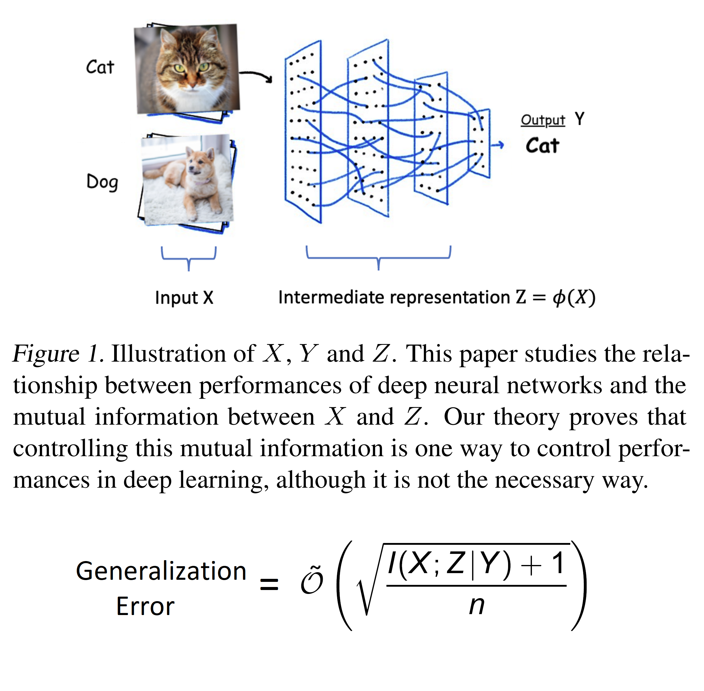

# ICML 2023: How Does Information Bottleneck Help Deep Learning?

This repository contains code for the ICML 2023 paper: [How Does Information Bottleneck Help Deep Learning?](https://arxiv.org/abs/2305.18887)

<p align="center">
    
</p>

In this paper, we provide the first rigorous learning theory for justifying the benefit of information bottleneck in deep learning by mathematically relating information bottleneck to generalization errors. We investigate the merit of our new mathematical findings with experiments across a range of architectures and learning settings. In many cases, generalization errors are shown to correlate with the degree of information bottleneck: i.e., the amount of the unnecessary information at hidden layers.

## Requirements

The code used Python 3.6.9 and PyTorch 1.10.1. A full list of environmental dependencies is given in `requirements.txt`.

## Running

The experiments for each dataset follow the same procedure. First the models are trained and saved along with SWAG parameters and initial metrics, then model compression metrics and results are computed.

The scripts for running experiments are given by:

- Clustering: `toy/scripts/main_swag.py`
- MNIST: `toy/scripts/main_swag_MNIST.py`
- CIFAR: `dnn/swag_repo/MI/main_multiseed.py`
- Binning: `toy/scripts/binning/main_swag_bin.py`

## Citation
```
@inproceedings{icml2023kzxinfodl,
  title={How Does Information Bottleneck Help Deep Learning?},
  author={Kenji Kawaguchi and Zhun Deng and Xu Ji and Jiaoyang Huang},
  booktitle={International Conference on Machine Learning (ICML)},
  year={2023}
}
```

## Acknowledgements

The SWAG part of the code is adapted from [A Simple Baseline for Bayesian Uncertainty
in Deep Learning](https://github.com/wjmaddox/swa_gaussian).
